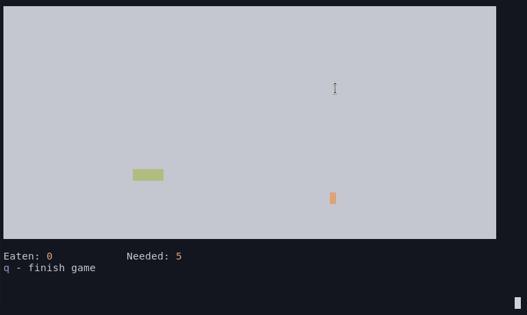

<p align="center">
     </br>
    A classic snake game written in bash
<p>

# About

> SNAKE in bash is an exciting action game which connects the elements of both
> and stategic game genres. Feel the taste of adrenaline by moving the snake
> in four cardinal diractions. Hunt and capture the food scattered around
> the board. Brace yourself for many hours of unforgettable play. Make
> decisions and see how the consequences affect the plot of the game.
> :)

# How to play

Just run the script

```
$ ./snake
```

And have fun!

## Controls:

```
    W - go north
    S - go south
    A - go west
    D - go east
```

# License

Snake is licensed under GPL. See [LICENSE](LICENSE) for more details.
